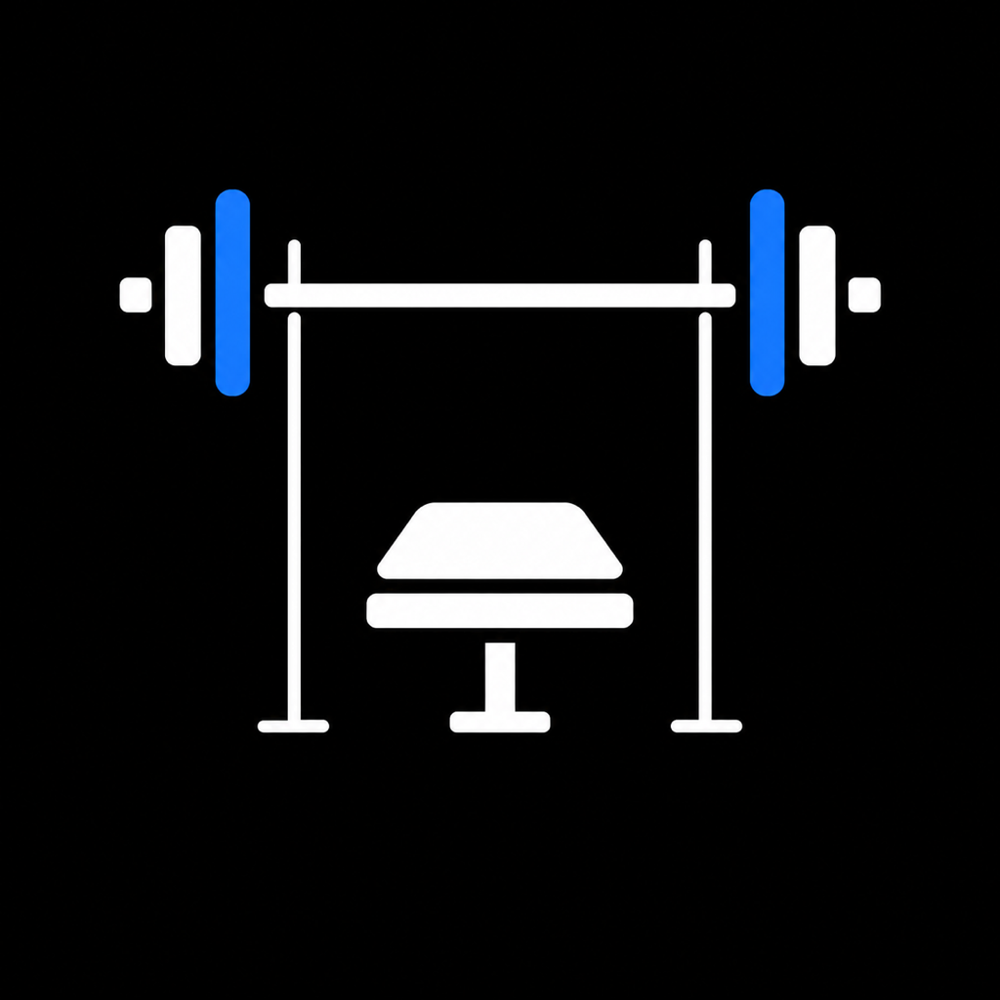

# ЖимЖим

<p align="center">
  
</p>

## Что это за приложение

**ЖимЖим** — личное iPhone-приложение для планирования тренировок и отслеживания прогресса.

В приложении можно:

- создавать и редактировать шаблоны тренировок;
- назначать тренировку на нужный день и получать локальное напоминание;
- начать тренировку по расписанию или из любого шаблона;
- записывать выполненные подходы, вес и повторения;
- добавлять и удалять упражнения и подходы во время тренировки;
- выбирать упражнения из каталога на русском языке с GIF-анимациями;
- просматривать календарь и историю завершённых тренировок;
- исправлять или удалять сохранённые тренировки;
- вести отдельную историю веса тела;
- смотреть время в зале, объём тренировок, динамику веса и серию регулярных тренировок.

### Где хранятся данные

История тренировок, шаблоны, расписание и замеры веса хранятся **только локально на iPhone** в базе SwiftData внутри защищённой папки приложения.

- GitHub содержит исходный код, иконку, каталог упражнений и GIF.
- После перезагрузки iPhone данные остаются.
- Повторная установка новой сборки через Xcode поверх существующей сохраняет данные, если не удалять приложение и не менять его Bundle Identifier.
- Если удалить приложение с iPhone, его локальные данные тоже удалятся.
- Облачной синхронизации, аккаунтов и серверной передачи данных сейчас нет.
- Папка с базой исключена из резервной копии iCloud, поэтому восстановить историю после удаления приложения пока нельзя.

## Как бесплатно установить приложение на свой iPhone через Xcode

Ниже описан официальный бесплатный способ. Программистом быть не нужно, но понадобится Mac, iPhone, кабель и обычный Apple Account.

### Что понадобится

- Mac с доступом в интернет;
- iPhone с iOS 17 или новее;
- кабель для подключения iPhone к Mac;
- бесплатная программа Xcode;
- обычный Apple Account. Платная подписка разработчика не нужна.

### Шаг 1. Установите Xcode

1. На Mac откройте **App Store**.
2. Найдите **Xcode** от Apple и нажмите **Установить**. Программа большая, загрузка может занять некоторое время.
3. После установки один раз откройте Xcode и согласитесь с предложенными условиями. Если Xcode попросит установить дополнительные компоненты, разрешите установку.

### Шаг 2. Скачайте проект

Самый простой способ без Терминала:

1. Откройте страницу репозитория: <https://github.com/NikronBecon/gym_app>.
2. Нажмите зелёную кнопку **Code**.
3. Выберите **Download ZIP**.
4. Откройте загруженный ZIP-файл. Рядом появится папка `gym_app-main`.
5. Внутри этой папки дважды нажмите файл `GymProgress.xcodeproj`. Проект откроется в Xcode.

Если Git уже установлен, проект можно скачать через Терминал:

```bash
git clone https://github.com/NikronBecon/gym_app.git
cd gym_app
open GymProgress.xcodeproj
```

### Шаг 3. Добавьте Apple Account в Xcode

1. В верхнем меню Mac выберите **Xcode → Settings…**.
2. Откройте вкладку **Accounts** или **Apple Accounts**.
3. Нажмите **+** и войдите в тот Apple Account, который используется на iPhone.
4. После входа закройте окно настроек.

Пароль и данные Apple Account сохраняются средствами Xcode и не добавляются в проект или GitHub.

### Шаг 4. Подключите iPhone

1. Подключите iPhone к Mac кабелем.
2. Разблокируйте iPhone.
3. Если iPhone спросит **«Доверять этому компьютеру?»**, нажмите **Доверять** и введите код-пароль телефона.
4. Подождите, пока Xcode закончит подключение устройства. В первый раз это может занять несколько минут.

### Шаг 5. Настройте подпись приложения

1. В левой части Xcode нажмите на самый верхний синий значок проекта **GymProgress**.
2. В появившемся окне выберите раздел **TARGETS → GymProgress**.
3. Откройте вкладку **Signing & Capabilities**.
4. Убедитесь, что включён пункт **Automatically manage signing**.
5. В поле **Team** выберите строку со своим именем и пометкой **Personal Team**.
6. Если рядом с **Bundle Identifier** появилась красная ошибка, замените значение на уникальное. Например: `com.ivanov.ZhimZhim`. Используйте латинские буквы, точки и без пробелов.

При последующих обновлениях используйте тот же Apple Account, Team и Bundle Identifier. Иначе iPhone воспримет сборку как другое приложение, и старая локальная история в нём не появится.

### Шаг 6. Выберите именно свой iPhone

1. В верхней панели Xcode найдите название устройства рядом с названием **GymProgress** и кнопкой запуска **▶**.
2. Нажмите на название устройства.
3. В разделе iOS Devices выберите свой iPhone.

Не выбирайте **Any iOS Device** или **Any iOS Simulator Device**: это варианты только для сборки, на них приложение запустить нельзя.

### Шаг 7. Запустите установку

1. Нажмите кнопку **▶** в левом верхнем углу Xcode. Можно также нажать клавиши **Command + R**.
2. Подождите завершения сборки. При первом запуске это может занять несколько минут.
3. Xcode установит **ЖимЖим** на iPhone и попробует открыть приложение автоматически.

### Шаг 8. Если iPhone попросит включить режим разработчика

1. На iPhone откройте **Настройки → Конфиденциальность и безопасность → Режим разработчика**.
2. Включите режим разработчика и согласитесь на перезагрузку.
3. После перезагрузки разблокируйте iPhone и ещё раз подтвердите включение режима.
4. Вернитесь к Mac и снова нажмите **▶** в Xcode.

Если iPhone сообщает о недоверенном разработчике, откройте **Настройки → Основные → VPN и управление устройством**, выберите свой Apple Account и нажмите **Доверять**. Этот пункт появляется только после первой попытки установки.

### Важное ограничение бесплатной установки

При использовании бесплатной **Personal Team** профиль приложения действует 7 дней. После этого приложение может перестать открываться. Чтобы продлить установку:

1. Подключите iPhone к Mac.
2. Откройте тот же `GymProgress.xcodeproj`.
3. Выберите свой iPhone.
4. Снова нажмите **▶**.

Не удаляйте приложение перед переустановкой: тогда локальные тренировки и замеры сохранятся. Ограничение в 7 дней установлено Apple для бесплатных аккаунтов: [справка Apple о Personal Team](https://developer.apple.com/help/account/basics/about-your-developer-account/).

### Как установить обновлённую версию

Если проект скачан через Git, откройте Терминал в папке проекта и выполните:

```bash
git pull
open GymProgress.xcodeproj
```

Если проект скачан ZIP-файлом, скачайте новый ZIP и откройте новый `GymProgress.xcodeproj`. Перед запуском выставьте **тот же Bundle Identifier**, который использовали раньше. Затем подключите iPhone и нажмите **▶**. Удалять установленное приложение не нужно.

### Если сборка не запускается

- **A build only device cannot be used to run this target** — сверху выбран `Any iOS Device`. Выберите свой настоящий iPhone.
- **Signing requires a development team** — откройте **Signing & Capabilities** и выберите свою **Personal Team**.
- **Bundle Identifier is not available** — замените Bundle Identifier на уникальный, например `com.вашеимя.ZhimZhim` латиницей.
- iPhone не виден в списке — разблокируйте телефон, переподключите кабель и подтвердите доверие к Mac.
- приложение установилось, но не открывается — включите **Режим разработчика** и при необходимости подтвердите доверие к своему Apple Account.

Инструкция основана на официальных материалах Apple: [запуск приложения на физическом устройстве](https://developer.apple.com/documentation/Xcode/running-your-app-on-simulated-or-physical-devices) и [включение режима разработчика](https://developer.apple.com/documentation/xcode/enabling-developer-mode-on-a-device).

Метаданные каталога упражнений основаны на проекте [hasaneyldrm/exercises-dataset](https://github.com/hasaneyldrm/exercises-dataset). Сведения о сторонних материалах находятся в [THIRD_PARTY_NOTICES.md](THIRD_PARTY_NOTICES.md).
